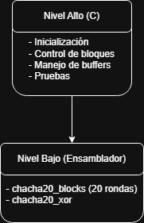

# Proyecto 1 – EL3310 Diseño de Sistemas Digitales

# Implementación de ChaCha20 en RISC‑V (LiteX)
-Profesor: Dr.-Ing. Jorge Castro-Godínez.  
-Estudiantes: Fabricio Mena Mejia, , .

## Introducción

Este documento describe la implementación del cifrador de flujo **ChaCha20** sobre un sistema basado en **RISC‑V (VexRiscv)** dentro del entorno **LiteX**.

---

## Objetivos

* Implementar ChaCha20 conforme al RFC 8439
* Separar lógica en C y ensamblador RISC‑V
* Integrar en LiteX como comando de BIOS
* Validar con pruebas funcionales completas
* Analizar comportamiento y rendimiento

---

## Diseño de la Solución

### Arquitectura General

Se dividió el sistema en dos niveles:

```

```

### Decisión clave

Se implementó el núcleo en ensamblador porque:

* Es la parte más intensiva en cómputo
* Permite control preciso del hardware
* Cumple el requisito del proyecto

---

## Detalles de Implementación

### 1. Estado interno

El estado se representa como:

```c
typedef struct {
    uint32_t state[16];
    uint32_t counter;
} ChaCha20_State;
```

### 2. Inicialización

La función de inicialización en C (`chacha20_init`) se encarga de construir el estado interno a partir de los parámetros externos (clave, contador y nonce). Sus responsabilidades son:

* Cargar las **constantes** de ChaCha20 en las posiciones 0–3 del arreglo `state[16]`.
* Copiar la **clave de 256 bits** (32 bytes) a las posiciones 4–11 del estado, realizando la conversión explícita a **little-endian** para que cada grupo de 4 bytes forme correctamente una palabra de 32 bits.
* Escribir el **contador de bloque inicial** en la posición 12 del estado y, en paralelo, en el campo `counter` de la estructura, de modo que el código de alto nivel pueda manejarlo de forma explícita.
* Insertar el **nonce de 96 bits** (12 bytes) en las posiciones 13–15, también en formato little-endian, siguiendo el orden exigido por el RFC 8439.

Esta función valida el tamaño de los arreglos de clave y nonce mediante constantes del código (no usa memoria dinámica) y deja el estado listo para que `chacha20_block` pueda generar el primer bloque de keystream sin modificar los parámetros originales.

---

### 3. Función `chacha20_block` (Assembly)

#### Flujo:

1. Copia del estado a la pila
2. 10 double rounds
3. Suma con estado original
4. Escritura a salida

#### Diagrama de flujo simplificado:

```
Estado inicial
      ↓
Copiar a working state
      ↓
10 iteraciones:
   - Column rounds
   - Diagonal rounds
      ↓
Sumar estado original
      ↓
Keystream (64 bytes)
```

Decisión importante:

* Uso de la pila para evitar modificar el estado original

---

### 4. Función `chacha20_xor`

* Implementación byte a byte
* Evita dependencias externas

Tradeoff:

* Más simple pero menos eficiente que una versión vectorizada

---

### 5. Cifrado (`chacha20_encrypt`)

Maneja:

* Bloques de 64 bytes
* Incremento del contador
* Bloques parciales

#### Flujo:

```
Mientras haya datos:
    generar keystream
    XOR con bloque
    incrementar contador
```

Además del cifrado/descifrado, el archivo `chacha20.c` incluye funciones de apoyo que organizan la demostración del algoritmo:

* **Rutinas de impresión** (`print_hex`, `print_hex_words`): permiten mostrar en la consola LiteX los contenidos de buffers y palabras en formato hexadecimal, facilitando la comparación visual con los vectores del RFC.
* **Comparación de buffers** (`buffers_equal`): recorre byte a byte dos arreglos y devuelve si son iguales, reemplazando a `memcmp` para ajustarse a las restricciones de la BIOS y mantener el control total del código.

Finalmente, en `chacha20.c` se implementa un conjunto de **funciones de prueba** que ejercitan la implementación con distintos escenarios:

* `test_rfc8439_vector`: prepara clave, contador y nonce específicos del RFC 8439, llama una vez a `chacha20_block` y compara el bloque de salida con el vector de referencia.
* `test_encrypt_decrypt`: cifra y luego descifra un mensaje corto, demostrando la reversibilidad del cifrador de flujo.
* `test_multiblock_message`: utiliza un mensaje largo que obliga a usar varios bloques de 64 bytes y verifica el manejo del contador de bloque.
* `test_partial_block_message`: fuerza un mensaje cuya longitud no es múltiplo de 64 bytes y muestra explícitamente cómo se procesa el último bloque parcial.

Todas estas pruebas se orquestan desde una función principal (`chacha20()`), que se registra como comando en la BIOS de LiteX a través de `main.c`. Al ejecutar dicho comando en la consola, el usuario puede observar paso a paso los resultados de cada prueba y confirmar el cumplimiento de los requisitos del proyecto.

---

## Pruebas Implementadas

### 1. Vector RFC 8439

* Verifica exactitud del algoritmo
* Compara palabras específicas

Resultado: PASS

---

### 2. Cifrado/Descifrado

* Verifica simetría del algoritmo

Resultado: PASS

---

### 3. Multi‑bloque

* Verifica incremento correcto del contador

Resultado: PASS

---

### 4. Bloque parcial

* Verifica manejo de longitudes no múltiplo de 64

Resultado: PASS

---

## Resultados Generales

| Prueba          | Resultado |
| --------------- | --------- |
| RFC 8439        | PASS      |
| Encrypt/Decrypt | PASS      |
| Multi-block     | PASS      |
| Partial block   | PASS      |

La implementación es funcional y correcta

---

## Análisis de Rendimiento

### Observaciones

* `chacha20_block` domina el tiempo de ejecución
* XOR es lineal O(n)
* Overhead por llamada a función en cada bloque

### Posibles optimizaciones

* Desenrollar loops en assembly
* Procesar múltiples palabras en XOR
* Usar registros en lugar de memoria (menos accesos a stack)

---

## Decisiones de Diseño Clave

| Decisión          | Justificación                        |
| ----------------- | ------------------------------------ |
| C + Assembly      | Balance entre claridad y rendimiento |
| Uso de stack      | Seguridad del estado original        |
| XOR simple        | Portabilidad                         |
| Contador separado | Facilita control de bloques          |

---

## Limitaciones

* No optimizado para rendimiento máximo
* No usa extensiones RISC‑V avanzadas
* No incluye autenticación (no es AEAD)

---

## Conclusión

La implementación cumple completamente con:

* Especificación RFC 8439
* Requisitos del proyecto
* Separación C/Assembly
* Manejo de bloques y casos borde

Además, el diseño es claro, modular y extensible.

---

## Referencias

[1] Y. Nir and A. Langley, "ChaCha20 and Poly1305 for IETF Protocols," Internet Engineering Task Force, RFC 8439, June 2018. [Online]. Available: https://datatracker.ietf.org/doc/rfc8439/

[2] Dr.-Ing. Jorge Castro-Godínez, "EL3310 Proyecto 1," Notas del curso EL3310, Escuela de Ingeniería Electrónica, Tecnológico de Costa Rica (TEC), Cartago, Costa Rica, Semestre I, 2026. [En línea]. Disponible en: https://tecdigital.tec.ac.cr/dotlrn/classes/E/EL3310/S-1-2026.CA.EL3310.2/file-storage/view/Proyectos%2FEL3310_proyecto1_1S2026.pdf


