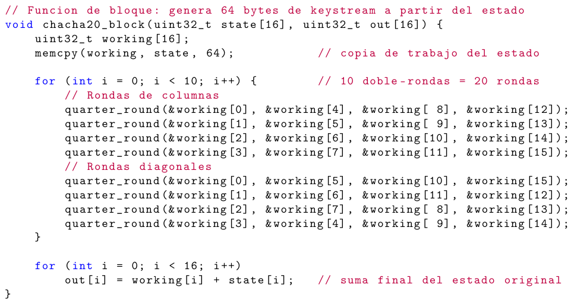
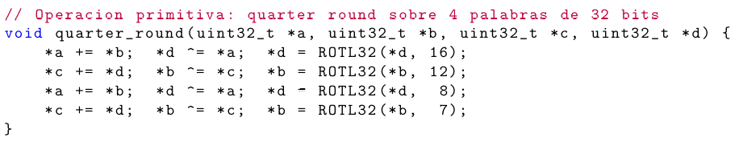

# Proyecto 1 – EL3310 Diseño de Sistemas Digitales

# Implementación de ChaCha20 en RISC‑V (LiteX)
-Profesor: Dr.-Ing. Jorge Castro-Godínez.  
-Estudiantes: Fabricio Mena Mejia, , .

## Introducción

Este documento describe la implementación del cifrador de flujo **ChaCha20** sobre un sistema basado en **RISC‑V (VexRiscv)** dentro del entorno **LiteX**.

---

## Objetivos

* Implementar ChaCha20 conforme al RFC 8439
* Separar lógica en C y ensamblador RISC‑V
* Integrar en LiteX como comando de BIOS
* Validar con pruebas funcionales completas
* Analizar comportamiento y rendimiento

---

## Diseño de la Solución

### Arquitectura General

Se dividió el sistema en dos niveles:


### Decisión clave

Se implementó el núcleo en ensamblador porque:

* Es la parte más intensiva en cómputo
* Permite control preciso del hardware
* Cumple el requisito del proyecto

---

## Detalles de Implementación

### 1. Módulo en C: `chacha20.c`

#### 1.1 Estado interno

En `chacha20.c` se define la estructura de datos principal que representa el estado de ChaCha20:

```c
typedef struct {
            uint32_t state[16];
            uint32_t counter;
} ChaCha20_State;
```

Este estado contiene:

* 16 palabras de 32 bits (`state[16]`), que corresponden a las constantes, la clave, el contador de bloque y el nonce, dispuestas como en la matriz de 4×4 descrita en [1] y [2].
* Un contador de bloque adicional (`counter`) que se usa para llevar el control explícito de cuántos bloques se han generado durante el cifrado de un mensaje.

<figure>
      
      <figcaption>Figura 1: Matriz de estado ChaCha20 del documento [2]</figcaption>
</figure>

#### 1.2 Inicialización (`chacha20_init`)

La función de inicialización en C (`chacha20_init`) se encarga de construir el estado interno a partir de los parámetros externos (clave, contador y nonce). Sus responsabilidades son:

* Cargar las **constantes** de ChaCha20 en las posiciones 0–3 del arreglo `state[16]`.
* Copiar la **clave de 256 bits** (32 bytes) a las posiciones 4–11 del estado, realizando la conversión explícita a **little-endian** para que cada grupo de 4 bytes forme correctamente una palabra de 32 bits.
* Escribir el **contador de bloque inicial** en la posición 12 del estado y, en paralelo, en el campo `counter` de la estructura, de modo que el código de alto nivel pueda manejarlo de forma explícita.
* Insertar el **nonce de 96 bits** (12 bytes) en las posiciones 13–15, también en formato little-endian, siguiendo el orden exigido por el RFC 8439 [1].  

Esta función valida el tamaño de los arreglos de clave y nonce mediante constantes del código (no usa memoria dinámica) y deja el estado listo para que `chacha20_block` pueda generar el primer bloque de keystream sin modificar los parámetros originales.

#### 1.3 Cifrado de alto nivel (`chacha20_encrypt`)

La función `chacha20_encrypt` implementa el cifrado/descifrado de mensajes de longitud arbitraria sobre el estado anterior. Maneja:

* Bloques completos de 64 bytes.
* El incremento del contador de bloque tras cada bloque procesado.
* El caso de **bloques parciales** cuando la longitud del mensaje no es múltiplo de 64 bytes.

El flujo general es:

```
Mientras haya datos por procesar:
            copiar el contador actual al estado
            generar bloque de keystream con chacha20_block
            determinar longitud del fragmento actual (<= 64)
            XOR entre keystream y fragmento de datos (chacha20_xor)
            incrementar contador de bloque
```

En cada iteración del bucle, la implementación calcula cuántos bytes quedan por procesar y limita el tamaño del fragmento actual a un máximo de 64 bytes (el tamaño del bloque de ChaCha20). Si la longitud total del mensaje es L y no es múltiplo de 64, el último bloque tendrá

      L_mod = L - 64 * floor(L / 64)

bytes, con 1 ≤ L_mod < 64, y solo esos bytes se pasan a `chacha20_xor`. El resto del keystream generado por `chacha20_block` en ese último bloque se descarta. De esta manera, no se introduce ningún relleno artificial y el cifrado se aplica exactamente sobre los bytes válidos del mensaje.

En la Prueba 4 (bloque final parcial), por ejemplo, un mensaje de 69 bytes se procesa en dos bloques: un bloque completo de 64 bytes y un último bloque parcial de 5 bytes, donde únicamente los 5 primeros bytes del segundo bloque de keystream se usan en la operación XOR.

#### 1.4 Funciones auxiliares y pruebas en `chacha20.c`

Además del cifrado/descifrado, el archivo `chacha20.c` incluye funciones de apoyo que organizan la demostración del algoritmo:

* **Rutinas de impresión** (`print_hex`, `print_hex_words`): permiten mostrar en la consola LiteX los contenidos de buffers y palabras en formato hexadecimal, facilitando la comparación visual con los vectores del RFC.
* **Comparación de buffers** (`buffers_equal`): recorre byte a byte dos arreglos y devuelve si son iguales, reemplazando a `memcmp` para ajustarse a las restricciones de la BIOS y mantener el control total del código.

También se implementa un conjunto de **funciones de prueba** que ejercitan la implementación con distintos escenarios:

* `test_rfc8439_vector`: prepara clave, contador y nonce específicos del RFC 8439, llama una vez a `chacha20_block` y compara el bloque de salida con el vector de referencia.
* `test_rfc8439_full_vector`: muestra y compara las 16 palabras completas del bloque generado con el vector oficial del RFC.
* `test_encrypt_decrypt`: cifra y luego descifra un mensaje corto, demostrando la reversibilidad del cifrador de flujo.
* `test_multiblock_message`: utiliza un mensaje largo que obliga a usar varios bloques de 64 bytes, calcula el número de bloques y el tamaño del último bloque parcial, y muestra tanto el cifrado completo como el bloque final parcial.
* `test_manual_message`: permite al usuario ingresar un mensaje por consola, cifrarlo y descifrarlo de forma interactiva.

Todas estas pruebas se orquestan desde una función principal (`chacha20()`), que se registra como comando en la BIOS de LiteX a través de `main.c`. Al ejecutar dicho comando en la consola, el usuario selecciona la opción deseada del menú y puede observar paso a paso los resultados de cada prueba.

---

### 2. Módulo en ensamblador: `chacha20_blocks.s`

El archivo `chacha20_blocks.s` contiene la implementación en ensamblador RISC‑V de la función de bloque de ChaCha20 (`chacha20_block`), responsable de generar 64 bytes de flujo de clave a partir del estado.

<figure>
      
      <figcaption>Figura 2: Funcion chacha20_block en C [2]</figcaption>
</figure>

#### 2.1 Flujo de la función `chacha20_block`

1. **Copia del estado a la pila**: se reserva espacio en la pila para las 16 palabras del estado y se copian desde el puntero de entrada. De esta forma, la función trabaja sobre una copia local sin modificar el estado original.
2. **Bucle de 10 double rounds (20 rondas)**: en cada iteración se aplican:
       * Cuatro *column rounds* (QR(0,4,8,12), QR(1,5,9,13), QR(2,6,10,14), QR(3,7,11,15)).
       * Cuatro *diagonal rounds* (QR(0,5,10,15), QR(1,6,11,12), QR(2,7,8,13), QR(3,4,9,14)).
      Cada *quarter round* realiza las operaciones ARX (sumas módulo 2^32, rotaciones de 16, 12, 8 y 7 bits, y XOR) usando registros temporales.
3. **Suma con el estado original**: al final del bucle, cada palabra de la copia transformada se suma con la palabra correspondiente del estado original y el resultado se escribe en el arreglo de salida (16 palabras, 64 bytes de keystream).

La función respeta la convención de llamada RISC‑V: preserva los registros callee‑saved, usa registros temporales para los cálculos internos y devuelve el resultado únicamente a través del puntero de salida.

---

### 3. Módulo en ensamblador: `chacha20_xor.s`

El archivo `chacha20_xor.s` implementa en ensamblador RISC‑V la operación de XOR entre el flujo de clave generado por `chacha20_block` y los datos de entrada.

<figure>
      
      <figcaption>Figura 2: Funcion chacha20_xor en C [2]</figcaption>
</figure>

La función `chacha20_xor` recibe:

* Un puntero al keystream (64 bytes por bloque).
* Un puntero al buffer de entrada (texto plano o cifrado).
* Un puntero al buffer de salida.
* La longitud en bytes a procesar.

Su funcionamiento es un bucle simple:

1. Mientras queden bytes por procesar, carga un byte del keystream y uno del buffer de entrada.
2. Calcula el XOR de ambos y lo escribe en el buffer de salida.
3. Avanza los punteros y decrementa el contador de bytes restantes.

Esta rutina se usa tanto para cifrar como para descifrar, y es llamada desde `chacha20_encrypt` para cada bloque (completo o parcial) de hasta 64 bytes.

---

## Pruebas Implementadas

Para verificar el resutlado de las pruebas se utilizó la página referenciada en [3].

### 1. Vector RFC 8439

* Verifica exactitud del algoritmo
* Compara palabras específicas

Resultado: PASS

---

### 2. Cifrado/Descifrado

* Verifica simetría del algoritmo

Resultado: PASS

---

### 3. Multi‑bloque con bloque final parcial

La tercera prueba utiliza un mensaje más largo que 64 bytes (por ejemplo, 131 bytes) con el fin de verificar simultáneamente:

* El incremento correcto del contador de bloque a lo largo de varios bloques.
* El manejo adecuado de un **bloque final parcial** cuando la longitud total del mensaje no es múltiplo de 64.

En esta prueba se muestra explícitamente:

* La longitud total del texto plano.
* El número de bloques de 64 bytes procesados.
* El número de bytes efectivos del último bloque parcial.
* El texto cifrado completo en hexadecimal.
* El texto cifrado correspondiente únicamente al último bloque parcial.

Tras aplicar nuevamente `chacha20_encrypt` sobre el texto cifrado, se recupera exactamente el mensaje original, lo que confirma tanto el correcto manejo del contador multi‑bloque como el descarte adecuado del keystream sobrante en el último bloque parcial.

---

## Resultados Generales

| Prueba          | Resultado |
| --------------- | --------- |
| RFC 8439                    | PASS      |
| Encrypt/Decrypt             | PASS      |
| Multi-block + bloque parcial| PASS      |

La implementación es funcional y correcta

En la salida de la demo `chacha20` en la consola de LiteX se aprecia que todas las pruebas se comportan según lo esperado:

* En la **Prueba 1**, las primeras cuatro palabras del flujo de clave obtenido (`e4e7f110 15593bd1 1fdd0f50 c47120a3`) coinciden exactamente con las palabras esperadas del RFC 8439, validando la implementación del bloque ChaCha20.
* En la **Prueba 2**, el texto plano "Hola Mundo ChaCha20" se cifra en una secuencia hexadecimal (`438180f0...f945a2`) y se recupera de forma idéntica tras el descifrado, demostrando la simetría del cifrador de flujo.
* En la **Prueba 3**, un mensaje de 131 bytes (mayor a 64) se cifra y descifra correctamente, evidenciando que el contador de bloques se administra bien en el caso multi‑bloque. Además, se muestra que el último bloque parcial (3 bytes en este caso) se procesa usando solo los primeros 3 bytes del último bloque de keystream, descartando el resto y recuperando el texto original, lo que confirma el manejo correcto del bloque final parcial descrito en la sección de cifrado.

---

## Análisis de Rendimiento

### Observaciones

* `chacha20_block` domina el tiempo de ejecución
* XOR es lineal O(n)
* Overhead por llamada a función en cada bloque

### Posibles optimizaciones

* Desenrollar loops en assembly
* Procesar múltiples palabras en XOR
* Usar registros en lugar de memoria (menos accesos a stack)

---

## Decisiones de Diseño Clave

| Decisión          | Justificación                        |
| ----------------- | ------------------------------------ |
| C + Assembly      | Balance entre claridad y rendimiento |
| Uso de stack      | Seguridad del estado original        |
| XOR simple        | Portabilidad                         |
| Contador separado | Facilita control de bloques          |

---

## Limitaciones

* No optimizado para rendimiento máximo
* No usa extensiones RISC‑V avanzadas
* No incluye autenticación (no es AEAD)

---

## Conclusión

- Se implementó ChaCha20 conforme al RFC 8439 sobre RISC‑V/LiteX.
- Se separó la lógica entre C y ensamblador respetando la ABI RISC‑V.
- Se verificó el cifrado/descifrado correcto en casos de un bloque, múltiples bloques y bloque final parcial.
- Se integró el algoritmo como comando de BIOS en LiteX y se validó con pruebas automáticas e interactivas.

---

## Referencias

[1] Y. Nir and A. Langley, "ChaCha20 and Poly1305 for IETF Protocols," Internet Engineering Task Force, RFC 8439, June 2018. [Online]. Available: https://datatracker.ietf.org/doc/rfc8439/

[2] Dr.-Ing. Jorge Castro-Godínez, "EL3310 Proyecto 1," Documentos del curso EL3310, Escuela de Ingeniería Electrónica, Tecnológico de Costa Rica (TEC), Cartago, Costa Rica, Semestre I, 2026. [En línea]. Disponible en: https://tecdigital.tec.ac.cr/dotlrn/classes/E/EL3310/S-1-2026.CA.EL3310.2/file-storage/view/Proyectos%2FEL3310_proyecto1_1S2026.pdf

[3] LDDGO, "ChaCha20 Encrypt/Decrypt Online," LDDGO Tools, 2026. [Online]. Available: https://www.lddgo.net/en/encrypt/chacha20-encrypt-decrypt. [Accessed: Apr. 3, 2026].
